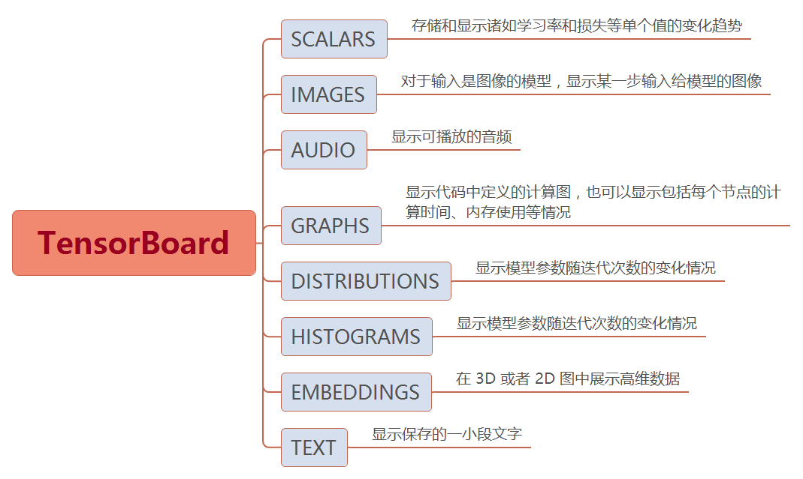

# TensorboardX

## 基础信息

[GitHub](https://github.com/lanpa/tensorboardX)  
[Document](https://tensorboardx.readthedocs.io/en/latest/tensorboard.html)

## 基础使用
* 前置环境
    * Python
    * PyTorch
    * torchvision
    * tensorflow
    * tensorboard
    * tensorboardX
    * opencv-python(读取图片)
* 基础使用
    1. 提供一个路径，将使用该路径来保存日志
    1. 无参数，默认将使用 runs/日期时间 路径来保存日志
    1. 提供一个 comment 参数，将使用 runs/日期时间-comment 路径来保存日志

    ```python
    import tensorboardX import SummaryWriter

    sw=SummaryWriter('runs/experiment_1')
    sw=SummaryWriter() # 默认使用'/runs/$datetime'
    sw=SummaryWriter(comment=$suffix) # 模式使用'/runs/$datetime-$suffix'
    ```
* 启动分析
    ```cmd
    conda activate $env_name
    tensorboard --logdir $log_dir_name
    ```

## scalars
```python
add_scalar(tag, scalar_value, global_step=None, walltime=None)
# tag(string): 变量名
# scalar_value(float): 变量当前批次值
# global_step(int): 训练的step值
# walltime(float): 记录值的时间(默认time.time())
```

## images
```python
add_image(tag, img_tensor, global_step=None, walltime=None, dataformats='CHW')
# tag (string): 数据名称
# img_tensor(torch.Tensor | numpy.array): 图像数据
# global_step(int): 训练的 step
# swalltime(float): 记录发生的时间，默认为 time.time()
# dataformats (string, optional): 图像数据格式,'CHW'(默认)、'HWC', 'HW'等
'''添加多张图片的方法
    :: torchvision.make_grid方法可以将多张图片合并为一张
    :: SummaryWriter.add_images方法可以直接添加多张图片
'''
```

## graphs
```python
add_graph(model, input_to_model=None, verbose=False, **kwargs)
# model (torch.nn.Module): 神经网络
# input_to_model(torch.Tensor | [torch.Tensor]): 深入神经网络的数据
```

## distributions | histograms
```python
add_histogram(tag, values, global_step=None, bins='tensorflow', walltime=None, max_bins=None)
# tag(string): 数据名称
# values(torch.Tensor | numpy.array): 用来构建直方图的数据
# global_step (int): 训练的 step
# bins (string): 分桶的方式, 取值有 ‘tensorflow’、‘auto’、‘fd’等
# walltime (float): 记录发生的时间，默认为 time.time()
# max_bins(int): 最大分桶数
```

## embeddings
```python
add_embedding(mat, metadata=None, label_img=None, global_step=None, tag='default', metadata_header=None)
# mat(torch.Tensor | numpy.array): 一个矩阵，每行一个数据样本(N*M)
# metadata(list | torch.Tensor | numpy.array): 一个一维列表，mat 中每行数据的 label，大小应和 mat 行数相同(标签类型: 1*N)
# label_img(torch.Tensor): 一个形如 NxCxHxW 的张量，对应 mat 每一行数据显示出的图像，N 应和 mat 行数相同: N*C*W*H(255必须归一化到0-1)
# global_step (int, optional): 训练的 step
# tag(string): 数据名称，不同名称的数据将分别展示
```

## add_text
## add_audio
## add_figure
